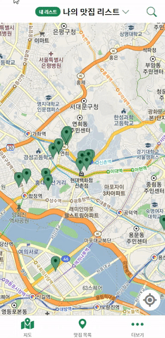
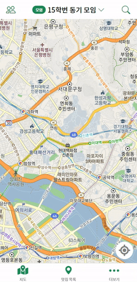
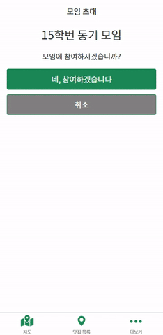
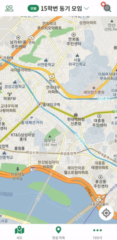

# Woochelin's Guide

>너와 나의 맛집 지도!
>우슐랭가이드

[사이트 링크](https://woochelins-guide.netlify.app/)

[Backend repository 링크](https://github.com/WoosubLeee/woochelins-guide-backend)

 

## 1. 기획 배경

:question: 맛집 광고에 속은 적이 있으신가요?

:question: 단톡방에 맛집을 물어본 적 있으신가요?

:question: 입맛이 비슷한 친구의 추천 맛집이 궁금하신가요?

이런 분들을 위해 준비했습니다.
친구들과 함께 만드는 신뢰할 수 있는 맛집 지도 **우슐랭가이드** 입니다.

**우슐랭가이드** 에서는:

:point_right: 친구와 그룹을 만들어 맛집을 서로 추천하고

:point_right: 나만의 맛집 리스트도 만들고

:point_right: 맛집 정보를 조회할 수 있습니다.

 

## 2. 사용 방법

- 모임 생성 및 초대

 

- 장소 검색 및 추천/저장

 

 

## 3. 개발

### 3.1. 기술 스택

> Frontend의 기술 스택만 담고 있습니다.

 version - 17.0.2

 

 version - 6

 

 version - 5

 

### 3.2. 개발자

  :raising_hand: **이우섭**

- GitHub - https://github.com/WoosubLeee
- Email - zbxv1423@naver.com

### 3.3. 향후 과제

- **모바일 앱 전환(React Native)**
- 홈 화면에서 모임/내 리스트 모아보기 기능
- 필터/정렬 기능
- 리뷰 기능
- UI 개선
- 예외 처리 강화
