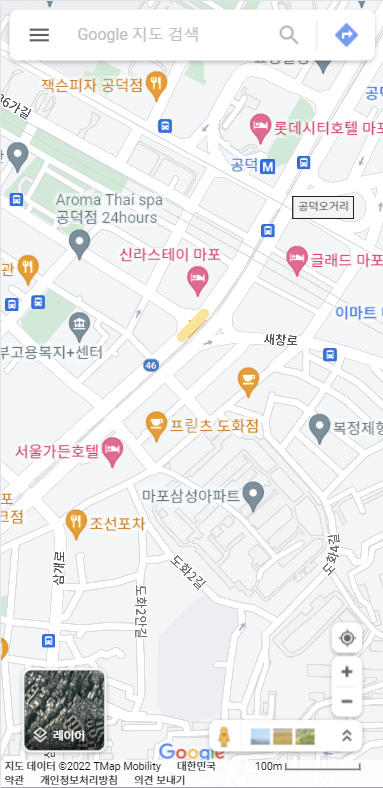
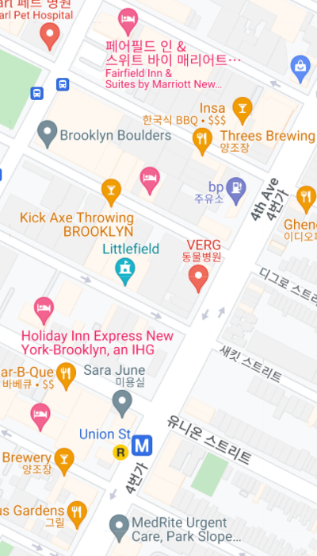
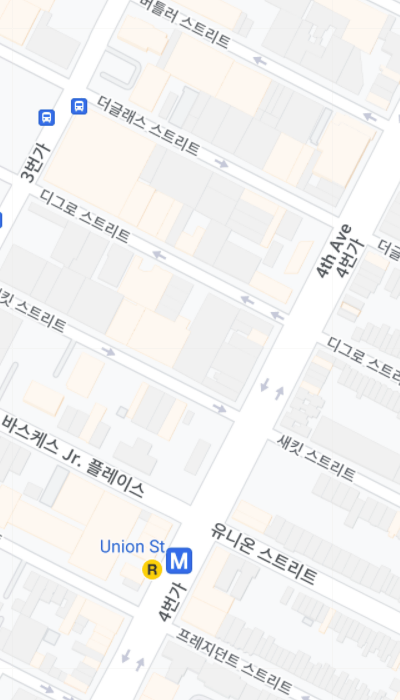
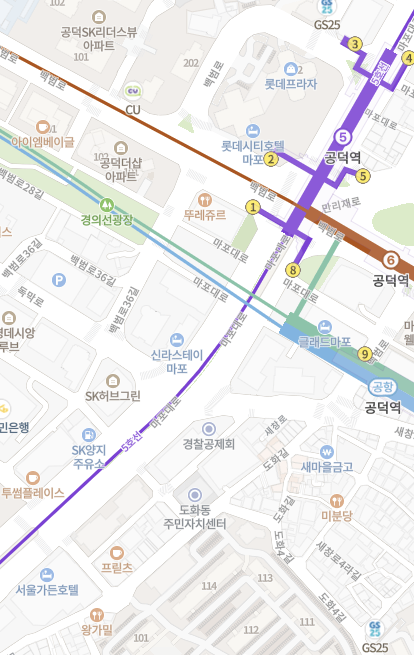
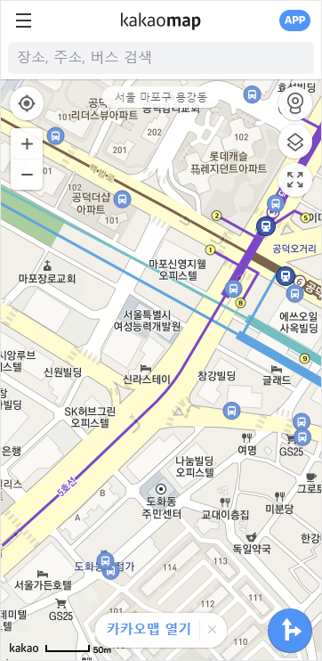

# 개발 기록

## 지도 API 선택하기

한국에서 사용할 만한 지도 API는 크게 세 가지로 나누어집니다.

1. [네이버 지도](https://www.ncloud.com/product/applicationService/maps)
2. [카카오 맵](https://apis.map.kakao.com/)
3. [Google Maps](https://developers.google.com/maps?hl=ko)

다 각각의 장단점이 있는데 이 중 우슐랭가이드에 어떤 것을 사용할지 정해야 하는 문제를 겪었습니다.

### 초기 기획 단계

Google Maps를 사용하여 개발하는 것으로 계획했었습니다. 그 이유는:

1. **해외 맛집 데이터**

   가장 주요한 이유입니다. 저는 이 서비스가 국내 맛집을 공유하는데도 이용하면 좋지만 해외여행을 할 때 한국인이 선호할 맛집을 공유하는 방식으로도 활용되면 좋겠다고 생각했습니다. 그렇기에 유일하게 해외 맛집 데이터를 갖고 있는 Google Maps를 가장 선호했습니다.

2. API가 잘 구축되어 있다.

    1. **검색 Autocomplete 기능**
    
       사용자의 검색 내용을 예측하여 우수한 사용자 경험을 제공할 수 있습니다.
    
    2. DB에 저장된 장소 id를 사용한 장소 정보 검색이 가능하다.
    
    3. 장소 사진 데이터 제공

따라서 Google Maps를 사용하여 개발을 시작했습니다.

### 1차 문제 발생

#### 문제

Google Maps를 사용하여 개발을 하는 중 문제에 봉착했습니다.



Google Maps는 위 사진과 같이 제가 추가한 것이 아닌, 이미 Google Maps에서 보여주는 마커들(POI - Point Of Interest)이 너무 많았습니다. 이 상태에서는 사용자가 등록한 맛집 마커와 섞여보이게 되어 구분이 어려워지는 문제가 있었습니다.

이 문제는 원래 Google Maps에서 제공하는 Map Style을 설정하면 해결이 가능한 문제입니다. 아래 두 사진은 같은 지역인데 Style에서 POI density만 다르게 설정한 것입니다.



하지만 [한국은 국가 안보적 이슈로 인해 지도의 해외 반출이 불가](https://medium.com/guleum/google-map-style-%EC%A0%81%EC%9A%A9%ED%95%98%EA%B8%B0-3042efc85c7e)하고, 따라서 Google Maps는 TMap의 지도를 가져다 쓰는 것으로 보입니다.  그래서인지 지도의 한국 영역에는 Style이 적용이 되지 않아서 이 방법은 사용하지 못했습니다.

#### 해결

따라서 다른 지도 API를 쓰는 것을 고려하게 되었고, 



네이버 지도(왼쪽), 카카오 맵(오른쪽) 두 후보 중 원 모양의 마커들이 있는 네이버 지도 대신 아무 마커도 없이 텍스트만 있는 카카오맵을 사용하기로 결정하였습니다. 다만, 해외 맛집도 추가할 수 있다는 기획은 유지하기 위해 한국 지도만 카카오 맵에서 가져다 쓰고, 해외 지도, 장소 검색, 정보는 그대로 Google Maps에서 가져와 위도, 경도 정보를 사용해 보여주기로 하였습니다.

- 지도
  - 한국 : 카카오 맵
  - 해외 : Google Maps
- 장소 : Google Maps

지도를 두 가지 다 사용하기 위해 아래와 같은 조건으로 개발하였습니다.

```
if (지도 중심 in 한국 영역 || 지도 zoom level < 한반도 다 보일 정도의 크기) {
	카카오 맵 사용
} else {
	Google Maps 사용
}
```

### 2차 문제 발생

#### 문제

두 지도를 혼용하며 개발을 거의 다 끝마친 상황에서 친구와 실사용 테스트를 해볼 때 한 가지 문제가 발생했습니다. 그것은 바로 Google Maps API의 비용 문제였습니다. Google Maps는 $200/월의 무료 크레딧을 지급하는데 제가 100개 가량의 맛집을 검색, 등록하는데 $5 정도 비용이 소모되었습니다.

비용 문제를 고려 안 한것은 아니었고, 일정 수준은 투자할 용의도 있었으나 한 명의 사용자만으로 저 정도의 비용이 발생하면 서비스 기획 자체가 잘못된 것이라 생각하여 다른 API 사용을 고려하게 되었습니다. 비용으로 인해 해외 맛집 기능 또한 포기하였습니다.

#### 해결

대체할 API로는 네이버 지도와 카카오 맵 중 카카오 맵을 선정하였는데 그 이유는:

- 검색 API가 조금 더 잘 되어있고
- 지도와의 통일성 유지에도 더 좋았기 때문입니다

이렇게 해서 카카오맵을 활용하여 개발은 마무리 지었지만, 향후 비용 문제가 해결이 된다면 Google Maps를 어떻게든 활용해보고자 하는 생각을 갖고있습니다.


## HTTP to HTTPS

대부분의 브라우저는 HTTP를 사용하는 웹사이트에서는 위치 권한을 사용할 수 없도록 막아놨습니다. 그 때문에 HTTPS로 전환하여 위치 권한을 사용할 수 있도록 하였습니다.

### SSL(TLS) 발급받기

HTTPS로 통신하기 위해서는 SSL을 발급받아야 합니다. SSL은 인증된 CA (Certificate Authority)로부터 발급받아야 합니다. 여러 발급 경로가 있지만 비용을 줄이기 위해 90일짜리 [무료 SSL](https://zerossl.com/)을 발급받았습니다.

발급받는 과정은 정말 간단하고, 발급업체의 introduction을 따르면 됩니다. 발급 과정에서 발급 요청자가 해당 도메인의 진짜 주인인지 확인하는 과정이 있습니다.

### Installing SSL certificate on Nginx

CA로부터 발급받은 certificates 파일들을 서버에 업로드했습니다. 그리고 Nginx conf 파일에 다음과 같은 내용으로 변경해줬습니다.

```
server {
  listen 80;
  server_name woochelinsguide.com www.woochelinsguide.com;
  return 301 https://$host$request_uri;
}

server {
  listen 443 ssl;

  ssl                 on;
  ssl_certificate     /home/ec2-user/ssl/certificate.crt;
  ssl_certificate_key /home/ec2-user/ssl/private.key;

  location / {
    root /home/ec2-user/woochelins-guide-frontend/build;
    index index.html index.htm;
    try_files $uri $uri/ /index.html;
  }
}

```

앞으로 HTTP로 들어오는 요청은 모두 HTTPS로 다시 redirect 될 수 있도록 분기해줬습니다. 그리고 Nginx를 reload 해주었습니다.

```bash
$ sudo systemctl reload nginx
```

### References

[Installing SSL Certificate on NGINX](https://help.zerossl.com/hc/en-us/articles/360058295894-Installing-SSL-Certificate-on-NGINX)
